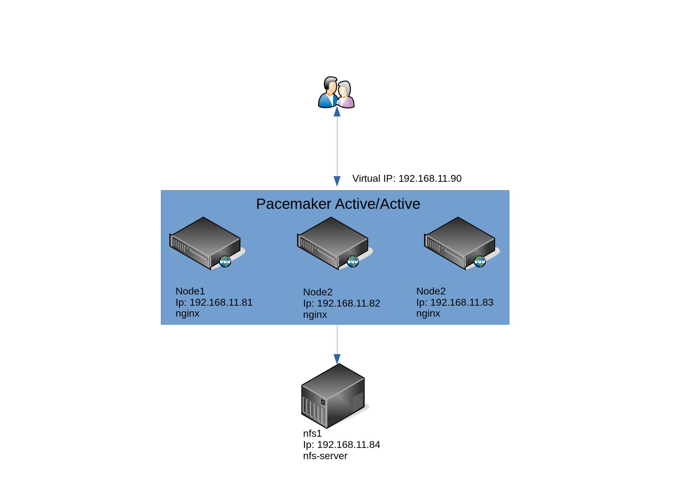

##### Nginx Cluster with Pacemaker and NFS storage
Main shemce


**Up 4 VMs for deploy(3 VMs for nginx, 1 for NFS)**
```bash
vagrunt up
```

**1. Install NFS server with ansible role** (This role install NFS-server, create FS on sdb drive and mount to /mnt/nfs on NFS-server)

``` bash
ansible-playbook playbooks/role_install_nfs.yml
```

**2.Install NFS-clients on nginx nodes** (This role install NFS-clients on nginx nodes and mount to /opt/nfsmount)
```bash
ansible-playbook playbooks/role_install_nfs_clients.yml
```

**3.Install and config nginx** (This role install nginx, change config from template)
```bash
ansible-playbook playbooks/role_install_nginx.yml
```

**4.Install and config Pacemaker** (This role install Pacemaker+pcsd+corosync, config cluster and start it)
```bash
ansible-playbook playbooks/role_install_pcs.yml
```
